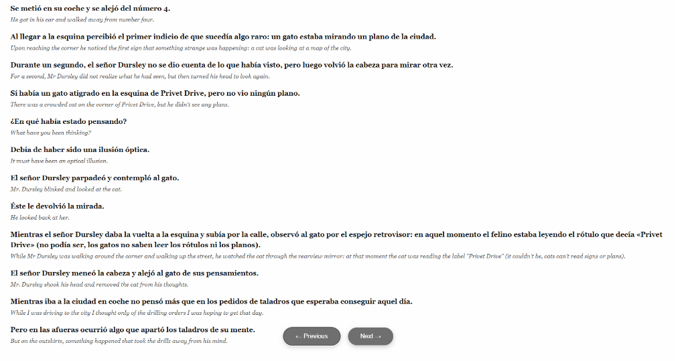
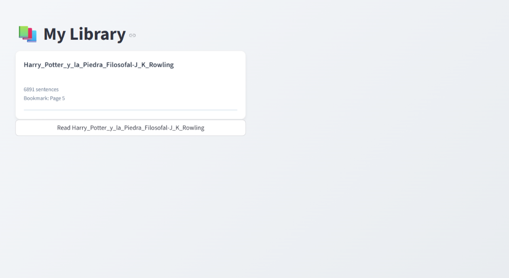

# 📚 Bilingual Reader
### AI-Powered Interlinear Reading Experience

**Learning a new language shouldn't mean constantly switching between a book and a dictionary.** 

Bilingual Reader is an open-source application that transforms standard Spanish PDFs into an immersive **interlinear reading experience**. By leveraging local AI, it generates contextual translations sentence-by-sentence, allowing you to read fluidly without breaking your flow.



## 💡 The Problem
Reading "native" content is the best way to master a language, but it's frustratingly difficult.
- **Constant Dictionary Lookups**: Breaking concentration to look up words every few seconds.
- **Loss of Context**: Translating single words often misses the sentence's meaning.
- **Boring Textbooks**: Interesting novels are often too difficult for intermediate learners.

## 🚀 The Solution
Bilingual Reader solves this by processing standard PDF books into a custom reading interface:
1.  **Smart Extraction**: Extracts text from PDFs while preserving flow.
2.  **Local AI Translation**: Uses the **MarianMT** neural network locally to translate sentences contextually—private and free.
3.  **Interlinear Format**: Displays the original text in bold with the English translation subtly underneath.



## 🛠️ Technical Architecture

This works as a full-stack application leveraging local ML inference and cloud synchronization.

*   **Frontend**: Built with **Streamlit**, featuring a custom generic **HTML/JS/CSS component** for the high-performance reading interface (virtualized pagination, touch gestures).
*   **Machine Learning**: Integrated **HuggingFace Transformers** running local inference models (Helsinki-NLP/MarianMT) for offline translation.
*   **Backend & Sync**: **Supabase** (PostgreSQL) handles library management, bookmark syncing across devices, and PDF storage.
*   **Processing Pipeline**: 
    1.  `PyMuPDF` extracts raw text.
    2.  `NLTK` tokenizes sentences intelligibly.
    3.  `Torch` + `Transformers` translate batches.
    4.  Result is synchronized to the cloud.

## ✨ Key Features

- **📱 Cross-Device Sync**: Read on your laptop, pick up on your phone. Bookmarks sync instantly via Supabase.
- **👆 Mobile Optimized**: A responsive "app-like" reading mode with swipe navigation and dynamic text sizing.
- **🔒 Privacy First**: All translation happens on your machine. No text is sent to third-party translation APIs.
- **📂 Personal Library**: Upload and manage your own collection of Spanish novels.

---

### Installation (For Developers)

If you wish to fork or run this locally:

1.  **Clone the repo**
    ```bash
    git clone https://github.com/jacobtordjman/bilingual-reader.git
    ```
2.  **Install dependencies**
    ```bash
    pip install -r requirements.txt
    ```
3.  **Run the App**
    ```bash
    streamlit run app.py
    ```
